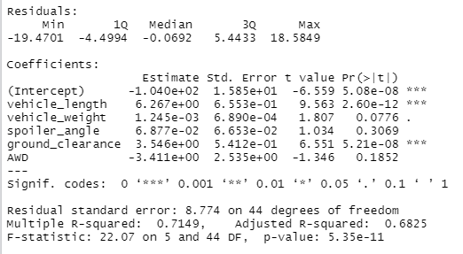
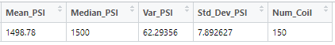
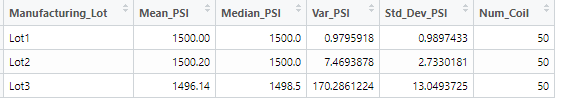
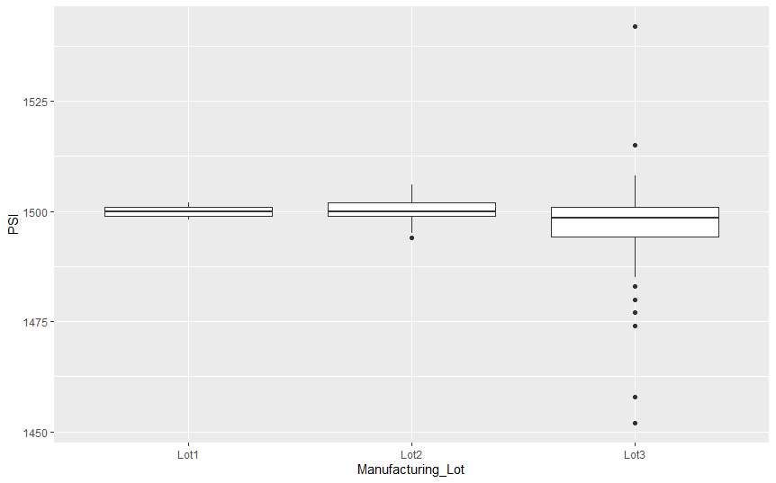
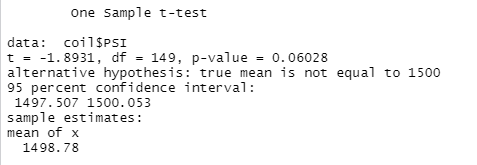
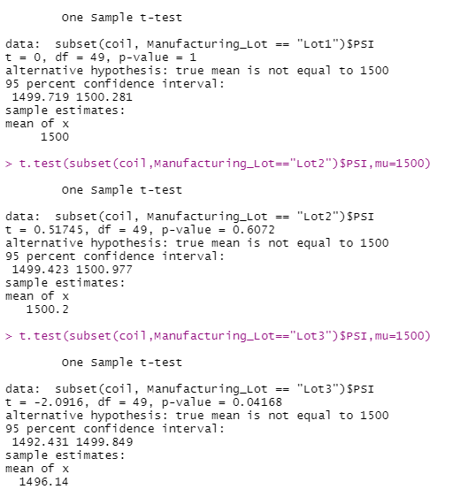

# MechaCar Statistical Analysis
## Summary
AutosRUs has decided to improve the decision-making process around new vehicle prototypes with additional data analytics around the manufacturing process.  The executives recognize the that to make the launch new prototype successful, they will need to use data analytics in each decision throughout the manufacturing process.  

Jeremy has been working for AutosRUs for 10 years, and has been asked to do some statistical analysis around production.  He is specifically reviewing struggles that the manufacturing team is having with the new prototype, MechaCar.  The team is responsible for looking at historical data, analytical verification and validation of current automotive specifications, and study design of future product testing.  

## Results
### Linear Regression to Predict Miles Per Gallon (MPG)
Before starting the analysis, a p-value of 0.05 as a tolerance level was chosen to test null and alternative hypotheses. 

The multiple line regression produced the following statistical results:

1. Which variables/coefficients provided a non-random amount of variance to the mpg values in the dataset?

    The p-values for vehicle length and ground clearance were below the 0.05 threshold to reject the null hypothesis.  They are likely to provide non-random variances to the model.  We can assume both are statistically significant to the mpg.

    On the other hand, the p-values for the vehicle weight, spoiler angle, and all-wheel-drive (AWD) trend towards a random amount of variance.

2. Is the slope of the linear model considered to be zero? 

    The p-value of 5.35 × 10-11 for the linear model is smaller than a significance level of 0.05. There is evidence to reject the null hypothesis, which leans toward a slope of our linear model is zero.  

3. Does this linear model predict mpg of MechaCar prototypes effectively?

    This linear model has an R-squared value of 0.71.  This indicates that approximately 71% of the mpg predictions can be determined by this model with the following linear regression formula:

        mpg = 6.28×(vehicle_length) + 1.245×10-3×(vehicle_weight) + 6.877×10-2×(spoiler_angle) 
        + 3.546×(ground_clearance) -3.411×AWD - 1.04×102

The multiple regression model does predict mpg effectively.

### Summary Statistics on Suspension Coils
The design specifications for the MechaCar suspension coils dictate that the variance of the suspension coils must not exceed 100 pounds per square inch. 

Does the current manufacturing data meet this design specification for all manufacturing lots in total and each lot individually?

Looking at the summary statistics of the full population (chart above), the PSI variance is 62.29 which is well within the specification limit of 100 PSI.  

By looking at the data grouped by individual lot number (below), it can be readily seen that the variance in lot #3 is over 170 while lot #1 and #2 are within the specification limit of 100 PSI at 0.98 and 7.47, respectively.  The variance of lot #3 is out of proportion from the other two lots.  This is sewing the overall PSI variance. 

Lot #3 should be investigated as to what is causing the issue so that adjustments can be made in the manufacturing and engineering process.

The below boxplot demonstrates how disproportionate lot #3 is to the full population.

### T-Tests on Suspension Coils
Several T-Tests were performed to determine if the PSI is statistically different across the different populations.

1. Full Population
     The p-value for the entire population is 0.06 with a mean of 1500.  We are able to reject the alternative hypothesis in favor of the null hypothesis.  The conclusion is there is no statistical difference in means.

2. Each Lot Independently
    Reviewing the p-values of each lot, we can see that p-value for lot 3 is 0.04 compared to lot #1 and #2 with a p-value of 1 and .61, respectively. This demonstrates significant evidence that suspension coiled in lot #3 is different from the population mean.

    Lots #1 and #2 have the same outcome as the full population.  with a sample mean of 1500.  We can reject the alternative hypothesis in favor of the null hypothesis because they are statistically similar.

    For lot #3, the conclusion is that we would reject the null hypothesis.  The p-value is significantly different from the other two data sets and the full population and the mean is statistically different when compared to the other data sets.  

    The manufacturing and engineering team should review the finding from lot #3 to determine future actions to correct any issues that may be found.  Locate and correct/remove any suspension coils that do not meet the minimum requirements.

### Study Design: MechaCar vs Competition
There are several ways to measure how the MechaCar will perform against their competitors.  These include 
* Similar performance metrics such as horsepower, engine size, fuel economy, how well it does in a quarter-mile, and more
* Consumer buying habits
* Safety ratings

**Metrics/Data**:

This study assumes that the MechaCar is a sports car with limited production and a high selling price.

To compare the MechaCar against it competitors we will look at other sports cars within the same price range.  There are many items to consider for comparison, but we will only be analyzing fuel economy and quarter-mile performance by collecting readily available data on several competitors.

**Hypothesis**:

Ho = There is no statistical difference between the MechaCar and its competitor in the given metric.

Ha = There is a statistical difference between the MechaCar and its competitor, and one car has an advantage over the other.

**Statistical Tests**:
1. Two-Sample T-Test to see if there are any statistical advantages in what we are measuring.
2. A Scatter Plot to see how fuel economy compares to performance on the quarter-mile.

*footnote:*
*I would also choose the standard p = 0.05 as my tolerance level to accept or reject the null hypothesis.*

