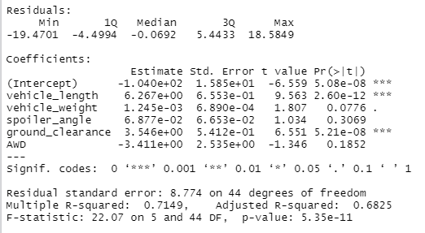

# MechaCar Statistical Analysis
## Summary
AutosRUs is realzing that their decision making process around new vehicle prototypes could be moved into the 21st century.  The executives recognize the that to make the launch new prototype to be successful, they will need to use data analytics in each decision throughout the manufacturing process.  

Jeremy has been working for AutosRUs for 10 years, and has been asked to do some statistical analysis around production struggles that the manufacturing team is having with the new prototype, MechaCar.  His team is responsible for looking at historical data, analytical verification and validation of current automotive specifications, and study design of future product testing.  

## Results
### Linear Regression to Predict Miles Per Gallon (MPG)
Before starting the analysis, a p-value of 0.05 as a tolerance level was chosen to test null and alternative hypotheses. 

The multiple line regression produced the following statistical results:

1. Which variables/coefficients provided a non-random amount of variance to the mpg values in the dataset?

    The p-values for vehicle length and ground clearance were below the p = 0.05 threshold to reject the null hypothesis.  They are likely to provide non-random variances to the model.  We can delcare both are statistically significant to the mpg.

    On the other hand, the p-values for the vehicle weight, spoiler angle, and all wheel drive (AWD) trend towards a random amount of variance.

2. Is the slope of the linear model considered to be zero? Why or why not?

    The p-value of 5.35 × 10-11 for the linear model is smaller than a significance level of p = 0.05 We have evidence to reject the null hypothesis, which leans toward a slope of our linear model is zero.  

3. Does this linear model predict mpg of MechaCar prototypes effectively? Why or why not?

    This linear model has an Rsquared value of 0.7149.  This indicates that approximately 71% of the mpg predictions can be determined by this model with the following linear regression formula:

        mpg = 6.28×(vehicle_length) + 1.245×10-3×(vehicle_weight) + 6.877×10-2×(spoiler_angle) 
        + 3.546×(ground_clearance) -3.411×AWD - 1.04×102

For our purposes, the multiple regression model does predict mpg effectively.